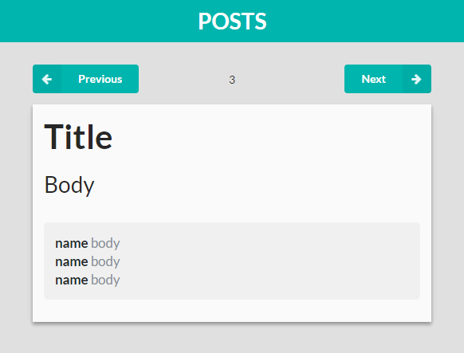
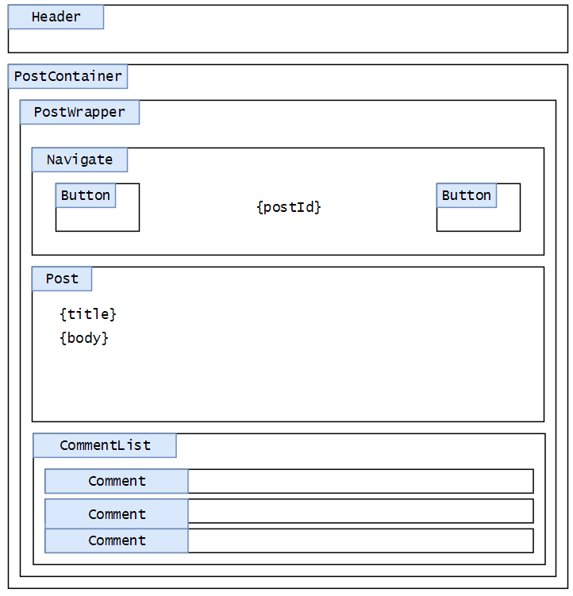
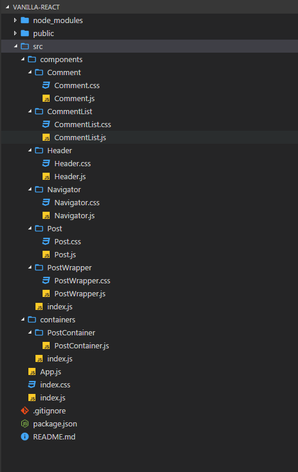

# 리액트 컴포넌트 구성
> 리액트 컴포넌트 구성 관련 가이드 입니다.

- <https://velopert.com/2597>

## 컴포넌트 구성
컴포넌트 파일들을 smart 컴포넌트 container 와, dumb 컴포넌트 components 디렉토리로 나눠서 구분 할 것입니다.

> **Q. smart(똑똑한) 컴포넌트 container, dumb(멍청한) 컴포넌트 components 그게 뭔뜻이죠?**
>
> 물론 실제로 멍청하거나 똑똑한건 아니고.. 추상적인 의미입니다. 이는 리액트 프로젝트에서 사용하면 유용한 패턴인데요, 조금 더 제대로 된 표현으로 쓰자면, 이 패턴에선 컴포넌트들이 presentational (멍청한) 컴포넌트와 container (똑똑한) 컴포넌트로 분류됩니다.
>
> 멍청한 컴포넌트들은 오직, props 로 전달받은 값을 렌더링하는것을 목표로 합니다. 이 컴포넌트들은 자신들만의 CSS 스타일을 가지고 있을 수 있구요, state 를 갖고있지 않습니다. 뭔가 처리를 해야 할 때는, 똑똑한 컴포넌트에서 선언된 함수를 props 로 전달받아서 실행합니다.
>
> 반대로 똑똑한 컴포넌트는 멍청한 컴포넌트들을 관리하는 녀석입니다. state 를 지닐 수 있고, 작업을 프로세싱 할 수 있죠. 그리고 기본적인 틀을 갖추기 위한 CSS 스타일만을 가지고있고, 복잡한 스타일을 갖고있지 않습니다.
>
> 이렇게 컴포넌트를 분류하면, 데이터의 흐름이 간편해진답니다. 추가적으로 컴포넌트의 재사용률도 높여주죠.

[Smart and dumbcomponents 관련 내용](https://medium.com/@dan_abramov/smart-and-dumb-components-7ca2f9a7c7d0#.3b0dbutob)

다음과 같이 프로젝트 레이아웃 디자인 화면이 있다는 가정하에 설계 하겠습니다.



위 레이아웃을 컴포넌트별로 구분을 해볼까요?



그러면 다음과 같은 컴포넌트 파일 구조로 나눠 볼 수 있습니다.



smart 컴포넌트들은 container 디렉토리안에서 관리하며 클래스 컴포넌트를 사용합니다.

dumb 컴포넌트들은 components 디렉토리안에서 폴더링으로 관리하며 함수형 컴포넌트를 사용합니다.

## 컨테이너 특징
- components들을 관리 합니다.
- state 를 지닐 수 있고, 작업을 프로세싱 할 수 있습니다.
- 기본적인 틀을 갖추기 위한 CSS 스타일만을 가지고있고, 복잡한 스타일을 갖고있지 않습니다.
- state 를 갖고있지 않습니다. 뭔가 처리를 해야 할 때는, 컨테이너 컴포넌트에서 선언된 함수를 props 로 전달받아서 실행합니다.

## 컴포넌트 특징
- props 로 전달받은 값을 렌더링하는것을 목표로 합니다.
- 자신들만의 상세 CSS 스타일을 가지고 있을 수 있습니다.

**컨테이너에서 컴포넌트 사용 예**
``` javascript
import React, {Component} from 'react';
import { PostWrapper, Navigate, Post } from '../../components';

class PostContainer extends Component {
    render() {
        return (
            <PostWrapper>
                <Navigate />
                <Post />
            </PostWrapper>
        );
    }
}

export default PostContainer;
```

**컴포넌트안에 인덱스 파일 설정 예**
``` javascript
import Header from './Header/Header';
import PostWrapper from './PostWrapper/PostWrapper';
import Navigate from './Navigate/Navigate';
import Postfrom './Post/Post';
import CommentList from './CommentList/CommentList';

export {
    Header,
    PostWrapper,
    Navigate,
    Post,
    CommentList
};
```